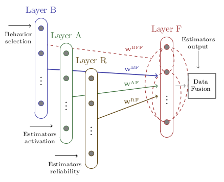

# The BAR-F Neural Network

Reliable fusion of black-box estimates of underwater localization

The research on robot tracking has focused on the problem of information fusion from redundant parametric estimations, though the aspect of choosing an adaptive fusion policy, that is computationally efficient, and is able to reduce the impact of un-modeled noise, are still open issues. The objective of this work is to study the problem of underwater robot localization. For this, we have considered a task relying on inertial and geophysical sensory. We propose an heuristic model that performs adaptable fusion of information based on the principle of contextually anticipating the localization signal within an ordered neighborhood, such that a set of nodes properties is related to the task context, and the confidence on individual estimates is evaluated before fusing information. The results obtained show that our model outperforms the Kalman filter and the Augmented Monte Carlo Localization algorithms in the task.

## Project content

In this repository you will find the GNU Octave implementation of the framework proposed for the experimental studies.

## Instructions

All that is required to do is to run the main script. Some auxilliary scripts are provided to generate additional plots for comparisson.

## Work reference

H. F. Chame, M. M. dos Santos, S. S. C. Botelho (2018) **Reliable fusion of black-box estimates of underwater localization**  2018 IEEE/RSJ International Conference on Intelligent Robots and Systems (IROS). doi:  10.1109/IROS.2018.8593593, available at https://ieeexplore.ieee.org/abstract/document/8593593

A video showing the experiment is available at https://youtu.be/jPywsajUCmE

